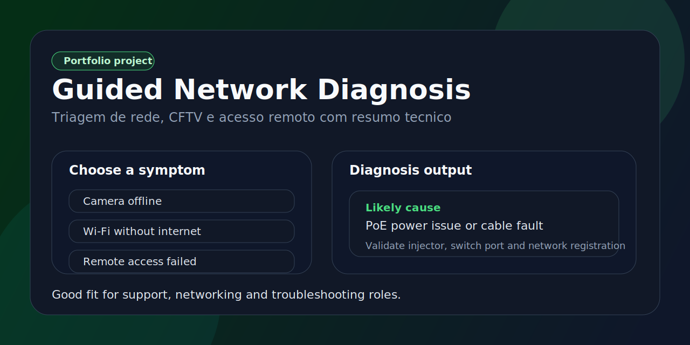

<p align="center">
  
</p>

<h1 align="center">Guided Network Diagnosis</h1>

<p align="center">
  Fluxo guiado para triagem de problemas de rede, CFTV e acesso remoto com resumo tecnico pronto.
</p>

<p align="center">
  
  
  
  
</p>

## Problema que resolve

No primeiro atendimento tecnico, muita energia se perde em perguntas repetidas e resumos mal escritos. Este app organiza a triagem inicial e gera uma saida clara para suporte ou abertura de chamado.

## O que o app entrega

- fluxo guiado por sintoma: camera offline, Wi-Fi sem acesso e falha de acesso remoto
- caminho de decisao com causa provavel e proxima acao
- resumo tecnico pronto para copiar
- base simples para salvar execucoes no Supabase

## Stack

- Next.js 15
- TypeScript
- Supabase
- CSS global customizado
- GitHub Actions

## Como rodar

```bash
npm install
cp .env.example .env.local
npm run dev
```

Sem configurar backend, o app continua funcional com historico demonstrativo.

## Arquivos importantes

- `app/page.tsx`: dashboard e apresentacao do fluxo
- `components/diagnosis-wizard.tsx`: wizard de triagem
- `lib/demo-data.ts`: historico de exemplo
- `supabase/schema.sql`: tabela de execucoes

## O que este projeto demonstra

- logica de decisao aplicada a suporte tecnico
- clareza de produto para operacao
- UX simples com alta utilidade
- portfolio alinhado com redes, CFTV e troubleshooting
